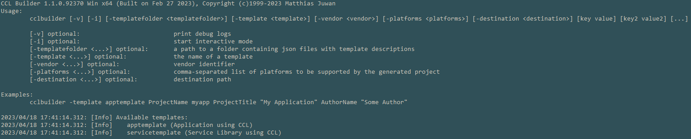

.. _ccl-tools-cclbuilder:

###########
CCL Builder
###########

**CCL Builder** is the preferred way to start a new application or plug-in based on the CCL framework. It's a command line tool available pre-compiled in:

.. code-block:: rst
  :caption: CCL SDK
	
  Mac: ~/Documents/CCL\ SDK-<version>-macOS/bin/cclbuilder
  Linux: /usr/bin/ccl/<version>/linux-x86_64/cclbuilder
  Win: C:\Program Files\Crystal Class Library/<version>/bin/win-x86_64/cclbuilder.exe
	
.. code-block:: rst
  :caption: Source Release

  Mac: tools/bin/mac/ccl/cclbuilder
  Linux: tools/bin/linux/ccl/x86_64/cclbuilder
  Win: tools\bin\win\ccl\cclbuilder.exe 

See also: :ref:`ccl-start-application`

