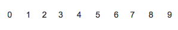
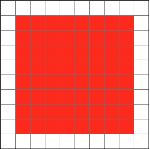
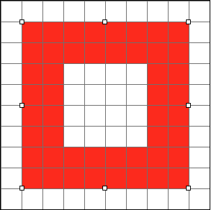
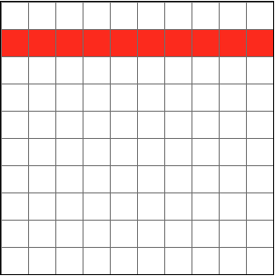
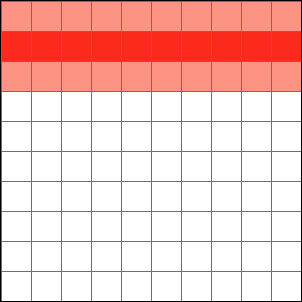
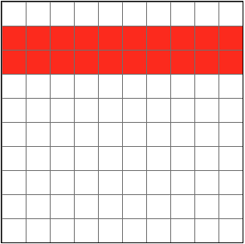
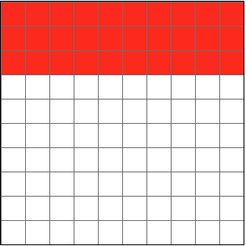
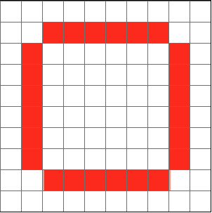
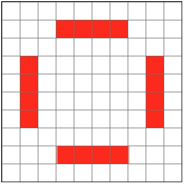

.. |cap1| replace:: 1 pixel per point, with aliasing
.. |cap2| replace:: 1 pixel per point, without aliasing

###########################
Geometric Shape Definitions
###########################

.. note::

  How the rect width is determined:

  .. code-block:: cpp

    template <typename Type>
    inline Type TRect<Type>::getWidth () const
    { return right - left; }

=======
Shape 1
=======

**Code**

.. code-block:: cpp

  Rect r (1, 1, 9, 9);
  // r.getWidth () == 8
  IGraphics::fillRect (r, brush)
  IGraphicsPath::addRect (r)
  QuartzPath::fill (device, brush)

  // same area for:
  // IGraphics::addClip (r)

**Resulting Bitmap**

+--------+--------+
| |cap1| | |cap2| |
+--------+--------+
| |pxs|  | |pxs|  |
+--------+--------+
| |l01|  |        |
+--------+--------+

=======
Shape 2
=======

**Code**

.. code-block:: cpp

  Rect r (1, 1, 9, 9);
  Pen pen (Colors::kRed, 1.0f);
  IGraphics::drawRect (r, pen);
  IGraphicsPath::addRect (r);
  QuartzPath::draw (device, pen);

  // for every path, draw with stroke 1 and
  // fill must have same outline

**Resulting Bitmap**

.. |l02| image:: img/shape_example2_aliased.png

+--------+--------+
| |cap1| | |cap2| |
+--------+--------+
| |pxs|  | |pxs|  |
+--------+--------+
| |l02|  |        |
+--------+--------+

=======
Shape 3
=======

**Code**

.. code-block:: cpp

  Rect r (1, 1, 9, 9);
  Pen pen (Colors::kRed, 2.0f);
  IGraphics::drawRect (r, pen);
  IGraphicsPath::addRect (r);
  QuartzPath::draw (device, pen);

**Resulting Bitmap**

+--------+--------+
| |cap1| | |cap2| |
+--------+--------+
| |pxs|  | |pxs|  |
+--------+--------+
| |l03|  |        |
+--------+--------+

=======
Shape 4
=======

**Code**

.. code-block:: cpp

  Point p1 (0, 1);
  Point p2 (10, 1);
  Pen pen (Colors::kRed, 1.0f);
  IGraphics::drawLine (p1, p2, pen);
  QuartzPath::addLine (p1, p2);
  QuartzPath::draw (device, pen);

**Resulting Bitmap**

+--------+--------+
| |cap1| | |cap2| |
+--------+--------+
| |pxs|  | |pxs|  |
+--------+--------+
| |l04|  |        |
+--------+--------+

=======
Shape 5
=======

**Code**

.. code-block:: cpp

  Point p1 (0, 1);
  Point p2 (10, 1);
  Pen pen (Colors::kRed, 2.0f);
  IGraphics::drawLine (p1, p2, pen);
  QuartzPath::addLine (p1, p2);
  QuartzPath::draw (device, pen);

  // So addRect looks different than adding
  // the four sides consecutively to a path

**Resulting Bitmap**

+--------+--------+
| |cap1| | |cap2| |
+--------+--------+
| |pxs|  | |pxs|  |
+--------+--------+
| |l05|  | |r05|  |
+--------+--------+

=======
Shape 6
=======

**Code**

.. code-block:: cpp

  Point p1 (0, 1);
  Point p2 (10 ,1);
  Pen pen (Colors::kRed, 3.0f);
  IGraphics::drawLine (p1, p2, pen);
  QuartzPath::addLine (p1, p2);
  QuartzPath::draw (device, pen);

**Resulting Bitmap**

+--------+--------+
| |cap1| | |cap2| |
+--------+--------+
| |pxs|  | |pxs|  |
+--------+--------+
| |l06|  |        |
+--------+--------+

=======
Shape 7
=======

**Code**

.. code-block:: cpp

  Rect r (1, 1, 9, 9);
  Pen pen (Colors::kRed, 1.0f);
  QuartzPath::addRoundRect (rect, 1, 1);
  QuartzPath::draw (device, pen);

**Resulting Bitmap (arcs not shown)**

+--------+--------+
| |cap1| | |cap2| |
+--------+--------+
| |pxs|  | |pxs|  |
+--------+--------+
| |l07|  |        |
+--------+--------+

=======
Shape 8
=======

**Code**

.. code-block:: cpp

  Rect r (1, 1, 9, 9);
  Pen pen (Colors::kRed, 1.0f);
  QuartzPath::addRoundRect (rect, 2, 2);
  QuartzPath::draw (device, pen);

**Resulting Bitmap (arcs not shown)**

+--------+--------+
| |cap1| | |cap2| |
+--------+--------+
| |pxs|  | |pxs|  |
+--------+--------+
| |l08|  |        |
+--------+--------+
