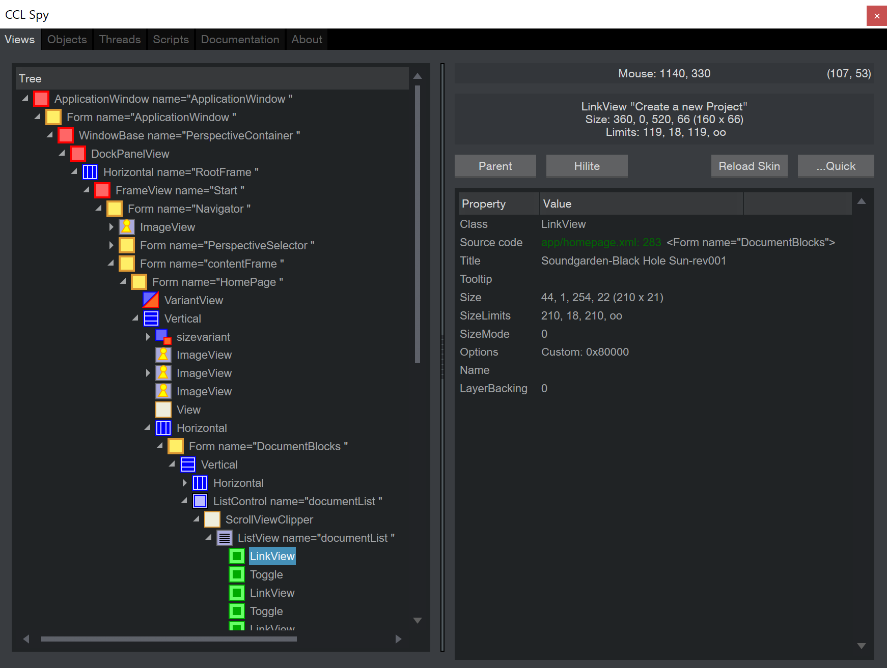
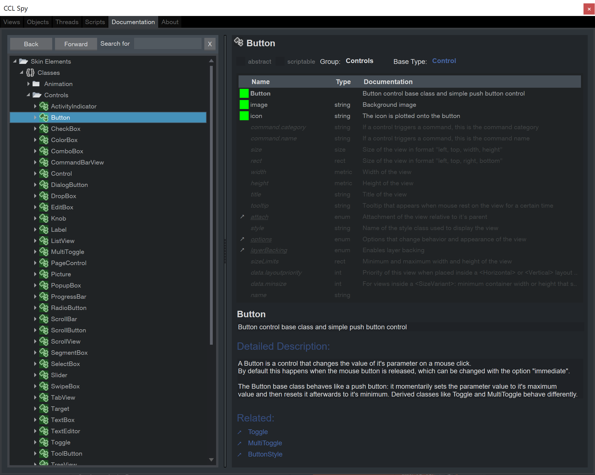
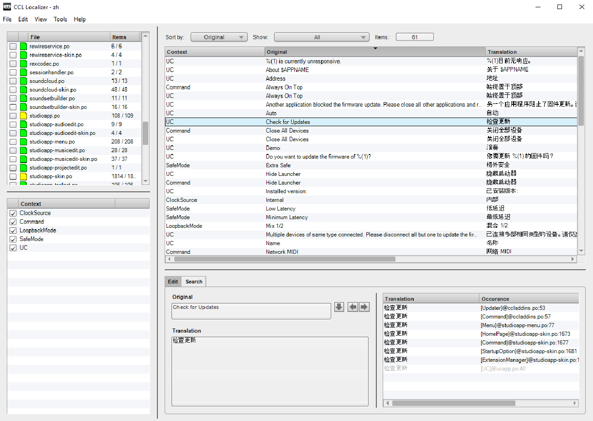
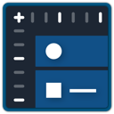
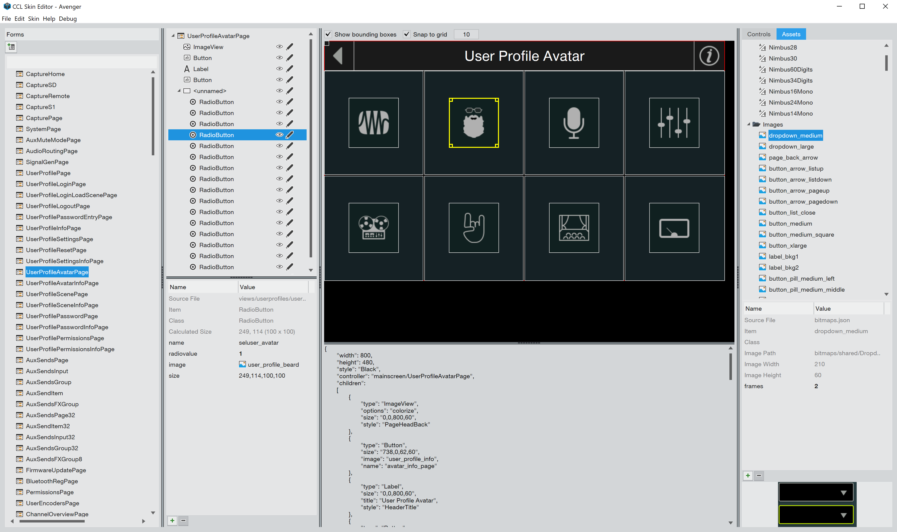

.. |cclspy| replace:: **CCL Spy**
.. |ccllocalizer| replace:: **CCL Localizer**
.. |cclskineditor| replace:: **CCL Skin Editor**

#########
CCL Tools
#########

=======
CCL Spy
=======

You can use |cclspy| while working with the XML-based UI definitions of your app. Press Ctrl+Alt+O to open the spy or open it from the Debug menu while your application is running. Pressing Ctrl shows the UI element under the mouse in the view hierarchy. "Reload Skin" supports live updates of the application GUI while editing the XML. The |cclspy| includes documentation for all available UI elements. The source code is located in

.. code-block:: rst
  
  services/ccl/cclspy

=============
CCL Localizer
=============

CCL is using the `GNU Gettext <https://en.wikipedia.org/wiki/Gettext>`_ file format for localization. The translation editor |ccllocalizer| can be downloaded from `ccl.dev <https://ccl.dev>`_.

===============
CCL Skin Editor
===============

Currently a work in progress started in February 2019 for graphical editing of JSON-based skins and optional C++ export.

