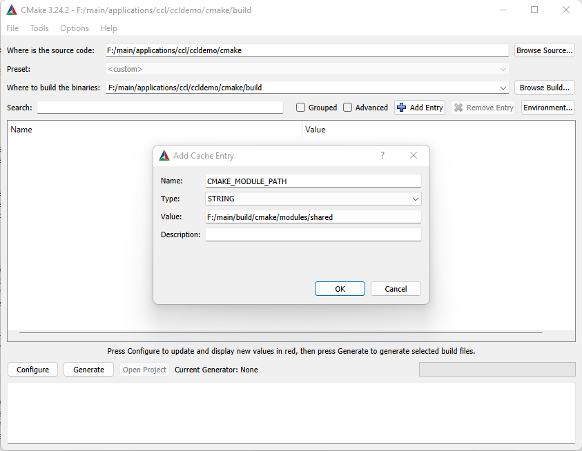
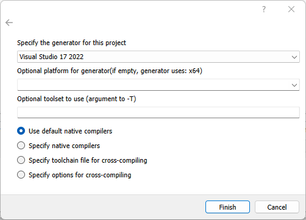

###########
Using CMake
###########

CMake offers a project description meta language and a tool to generate projects.

CMake is not a substitute for Visual Studio projects, XCode projects or Makefiles. Instead, CMake can be used to generate them from platform- and IDE-independent descriptions.

-------------
Install CMake
-------------

Download the latest release from https://cmake.org/download/.

The installer contains both the cmake command line tool and the graphical tool cmake-gui.

Additional information on how to use CMake can be found in the official `User Interaction Guide <https://cmake.org/cmake/help/latest/guide/user-interaction>`_

-------------------------------
Platform-specific Configuration
-------------------------------

Visual Studio
-------------

As we use CMake presets, you should configure Visual Studio to use these presets.

Under ``Tools`` → ``Options`` → ``CMake`` set ``CMake configuration file:`` to ``Always use CMake Presets``.

.. note::

	Microsoft added support for CMake Presets version 4 in Visual Studio 2022 17.4.
	Make sure to update to 17.4 or later.

-------------------------------
Generate Projects using Presets
-------------------------------

.. note::

	This is the recommended way to generate projects. If there is no preset available for your platform/project or you want to use different settings, you can `Generate Projects without Presets`_.

Make sure to update to CMake 3.30 or later when using presets.

Building CMake projects often requires several options to be set to the right values. To make this process easier, CMake introduced presets.

If there is a CMake preset available for your project (look for a ``CMakePresets.json`` file), you can check for available presets:

.. code:: bash

	cd <appname>/cmake/
	cmake --list-presets

This will produce an output similar to

.. code:: bash

	Available configure presets:

	  "win32" - Windows 32bit
	  "win64" - Windows 64bit
	  etc.

To generate a project using a preset, simply run

.. code:: bash

	cmake --preset=win32

You can also load the preset file in cmake-gui if you prefer a GUI tool.

---------------------------------
Generate Projects without Presets
---------------------------------
	
To generate a project for your IDE from an existing CMake description, you can either use the command line or the GUI tool cmake-gui.

Command Line Usage
------------------

.. code:: bash
	
	cd <appname>/cmake
	mkdir build
	cd build
	cmake -D CMAKE_MODULE_PATH=<repository root>/build/cmake/modules/shared ..

The call to cmake generates a project for your default build system (Visual Studio on Windows, Makefile on Mac/Linux, ...).

The last parameter of this call is the directory of the project's ``CMakeLists.txt``. This file contains information about source files, compiler options etc.

The parameter ``-D CMAKE_MODULE_PATH=<repository root>/build/cmake/modules/shared`` helps CMake find custom modules.

The project files are generated in the current working directory. You can run cmake from any directory you want. Most people create a directory ``build`` next to ``CMakeLists.txt``, but you can choose any location.

If you want to generate a project for a specific IDE, e.g. XCode or an older version of Visual Studio, you can specify a "generator" with the ``-G`` parameter:

.. code:: bash
	
	cmake -G Xcode ..
	cmake -G Ninja ..
	cmake -G "Visual Studio 14 2015" ..

Note that there is no generator for VS Code. If you want to use a CMake project with VS Code, startup VS Code, install the extensions ``CMake``, ``CMake Tools`` and ``C/C++`` and use ``File`` → ``Open Folder`` to open the directory containing the ``CMakeLists.txt`` file.

If you want to generate a Visual Studio project for another architecture, you can specify this with the ``-A`` parameter:

.. code:: bash
	
	cmake -G "Visual Studio 16 2019" -A ARM64 ..
	cmake -G "Visual Studio 16 2019" -A Win32 ..

See https://cmake.org/cmake/help/v3.30/manual/cmake-generators.7.html for additional options.

The CMake description of a project might offer some options. To set an option, you can use the ``-D`` parameter. 
You can use this parameter multiple times.

For example, to generate a project that uses CCL libraries from a custom location on Windows:

.. code:: bash

	cmake -D CMAKE_MODULE_PATH=<repository root>\build\cmake\modules\shared -D CCL_DIR=C:\Users\<username>\modifiedCCL ..
	
GUI Tool
--------

Open the ``cmake-gui`` application.

Click on ``Browse Source...`` and select the directory containing your ``CMakeLists.txt`` file.

Click on ``Browse Build...`` and select the directoy you want CMake to write your project files to.

.. note::

	The labels "Where is the source code" and "Where to build the binaries" are a little misleading...
	
Click on ``Add Entry`` and add a path parameter ``CMAKE_MODULE_PATH`` pointing to the cmake modules directory in your working copy.

Click on "Configure".
Depending on your system, CMake might ask you what kind of project you want to generate.

Click on ``Finish``.

If everything goes right, the last line in CMake's output reads ``Configuring done``.

You may now change some of the options that are displayed in the table.

Click ``Generate`` when you're done.

-----------------
Building Projects
-----------------

Once the project files are generated, you can open the project in your IDE and build/debug/run from there.

If you just want to build the project without opening your IDE, you can do this with CMake too:

.. code:: bash
	
	cmake --build . --config Release

.. note:: 

	Not all "generators" (e.g. Makefile generators) support multi-config projects. This means, not all generators support the ``--config Release`` options. For those generators, add ``-DCMAKE_BUILD_TYPE=Release`` when generating the project.
	
-------------------
Adding Source Files
-------------------

Don't use your IDE to add/remove/rename files in your projects.
Changes will be lost the next time CMake runs (e.g. on your next build).

Instead, open the ``CMakeLists.txt`` file and specify additional source files there. See :ref:`cmake-developer` for details.