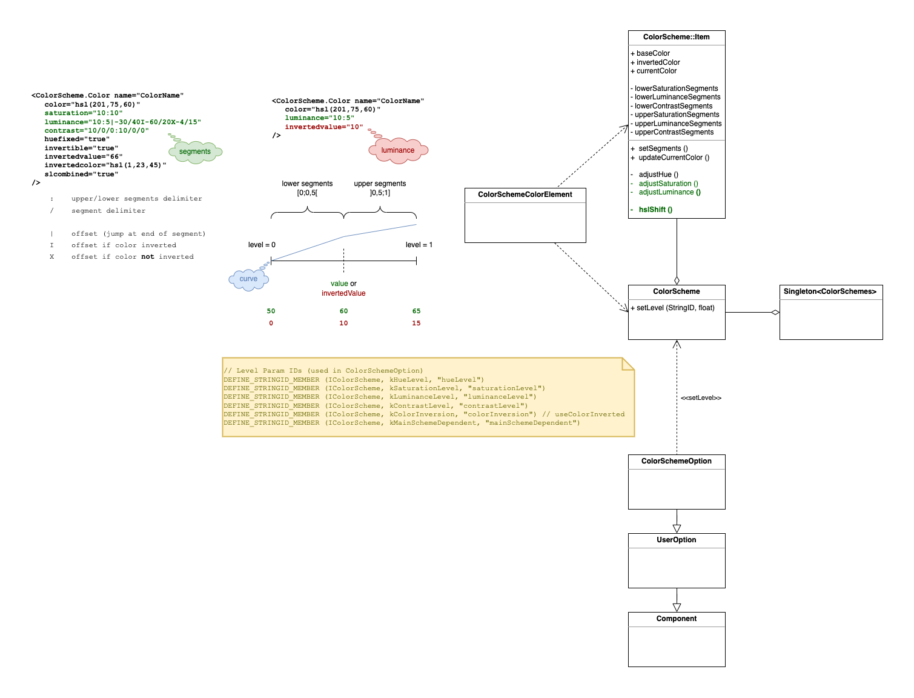

.. include:: ../../reference/skin-elements-classmodel.ref.rst

############
Colors
############

Colors can be defined using HSV, HSB, or hexadecimal notation. For greater flexibility, you can also use :ref:`Colorscheme.Colors<colors_scheme>`, which adapt their color tones based on the user's settings.

.. code-block:: xml

      <Resources>

        <!-- colors -->

        <Color name="ColorA" color="red"/><!-- standard colors (red, green, blue, yellow etc.) - use for prototyping purposese only -->
        <Color name="ColorB" color="#123456"/> <!-- hex -->
        <Color name="ColorB2" color="#123456ab"/> <!-- hex alpha -->
        <Color name="ColorC" color="hsl(120,100,50)"/>	<!-- hue [0-360], saturation [0-100], luminance [0-100] -->
        <Color name="ColorC2" color="hsl(120,100,50,10)"/>	<!-- hue [0-360], saturation [0-100], luminance [0-100], alpha [0-100] -->
        <Color name="ColorD" color="hsv(120,100,50)"/> <!-- hue [0-360], saturation [0-100], value [0-100] -->
        <Color name="ColorD2" color="hsv(120,100,50,10)"/> <!-- hue [0-360], saturation [0-100], value [0-100], alpha [0-100] -->

        <ColorScheme name="Main"><!-- ColorScheme.Color dependent on "Main" ColorScheme settings -->
          <ColorScheme.Color name="ColorE" color="hsl(212,100,50)"/>
          <ColorScheme.Color name="ColorF" color="hsl(212,100,50)" luminance="10:20" invertedColor="hsl(190,100,40)"/>
        </ColorScheme>

      </Resources>

The :ref:`neutraldesign<neutralbase_and_neutraldesign>` package defines multiple ColorScheme.Colors that are useful for accompanying custom styles and shape definitions:
For example, "@Main.LabelColor" (commonly used as the default text color for many controls) should also be considered the preferred "textcolor" in :ref:`custom styles<visual_styles>`, as it automatically supports color inversion.
You can find a list of these common ColorScheme.Colors in the sharedcolors.xml file inside the neutraldesign skin package.

.. code-block:: xml

			@Main.LabelColor                - Default color for static text
			@Main.LabelColor.Secondary      - Secondary color for static text
			@Main.IconColor                 - Default color for icons on buttons
			@Main.HighlightColor            - Primary highlight color
			@Main.WindowBackgroundColor     - Window backcolor

.. _colors_scheme:

*************
Color Scheme
*************

A |xml.class.colorscheme.color| supports color inversion, changes to hue, saturation and luminance, depending on the user settings in the app’s color scheme options.

Skin Attributes

:color: defines base color
:huefixed: keeps the base color’s hue value as is when color scheme option hue level changed
:invertible:  [default: true] defines whether a color is affected by color inversion (e.g. set to false if you don’t want it to automatically invert)
:invertedcolor: defines specific color when inverted
:invertedvalue: overrides luminance value of base and inverted color when inverted
:saturation: defines how saturation value is affected when color scheme options are changed (value or curve)
:luminance: defines how luminance value is affected when color scheme options are changed (value or curve)
:contrast: defines how contrast values are affected when color scheme options are changed (value or curve) 
:slcombined: increases the saturation with increasing luminance *(deprecated)*

Value Curves
############
A value curve is linear in general. Each curve can define segments with different slopes.

* there are 2 sections separated by a ``:`` - lower segments : upper segments
* segments are separated by ``/`` 
* the value that is added to the base color value at the "end" of a segment is defined by the segment value divided by the number of segments in this section
* segments are uniformly spread over a section
* lower segments' end is at min - upper segments' end is at max
* a segment can define a jump offset at its end:

  - ``|`` always applied
  - ``I`` applied when colorInversion is set
  - ``X`` applied when colorInversion is not set

