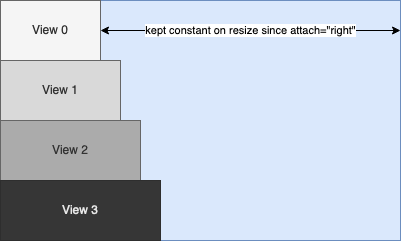
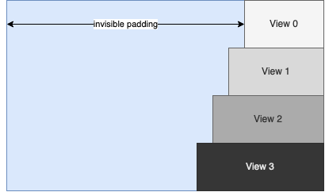

.. include:: ../../reference/skin-elements-classmodel.ref.rst

######
Layout
######

Each view can contain other views as child views. The coordinates of a child view are relative to the parent view. If a part of the child view exceeds the area of the parent view it is clipped.

Views can be arranged responsively considering outer constraints like the available size within their parent and/or according to inner constrains like the required size to properly display their contents (e.g. a label containing text of a specific length).

Two layout systems are supported, anchor layouts and a subset of the CSS Flexbox layout system.

Both can be used side-by-side and nested withing the same view tree. For more information on interfacing between both systems, see chapter :ref:`Interfacing between Flexbox and Anchor Layouts<Flexbox_anchor_interfacing>`.

*************
Anchor Layout
*************

By default, resizing a view doesn't affect the size or relative position of it's children. However, the "attach" attribute of a |xml.class.view| offers several options to define a certain relationship between positions and sizes of child and parent views.

Basic Layout of Views
=====================

By specifying one or more of the four edge names "left, right, top, bottom" the respective edges of the child follow the corresponding parent edges. When the parent view is resized, the distance between an attached child edge and it's corresponding parent edge stays fixed as long as possible within the current size limits. 

Table 3.1. View Attach Examples
===============================

========================= ============
Attachement               Description
========================= ============
attach="left"  
attach="right"	          View follows the right parent edge
attach="left right"	      Both left and right edges are attached to the parent, the view is resized by the same amount as its parent
attach="all"	 
attach="hcenter vcenter"  View is centered in parent
attach="hfit vfit"	      Fit size of view to its child views
========================= ============

Responsive Children and Alignment
=================================
Within a tree of views there are in general two types of reaction to a change:

* Parents react to changes within their children e.g. a view suddenly has to provide more information and needs more space so the parent increases it's size to fit all children
* Children react to changes within their parent e.g. the parent is restricted to a certain size, maybe due to a small screen, so it's children have to adapt to the available space

In the latter case, the behaviour of "attach"  must not be confused with alignment, i.e. setting attach="right" on all children of a view like

.. code-block:: xml

    <Vertical width="400" attach="left right">
        <View0... width="100" attach="right"/>
        <View1... width="120" attach="right"/>
        <View2... width="140" attach="right"/>
        <View3... width="160" attach="right"/>
    </Vertical>

will result in the following layout:

The attachment to the right edge doesn't affect the initial positions and sizes of view 0 to 3 but defines that the distances to the right edge of the parent should remain constant when the parent is resized.

Alignment with the right edge of the parent can be achieved by adding automatically sized padding using |xml.class.view| or |xml.class.space| objects in combination with the "unifysizes" option in parent views.

.. code-block:: xml

    <Vertical options="unifysizes" width="400" attach="left right">
        <Horizontal attach="left right">	
            <Space attach="left right"/>
            <View0... width="100"/>
        </Horizontal>
        <Horizontal attach="left right">
            <Space attach="left right"/>
            <View0... width="120"/>
        </Horizontal>
        <Horizontal attach="left right">
            <Space attach="left right"/>
            <View0... width="140"/>
        </Horizontal>
        <Horizontal attach="left right">
            <Space attach="left right"/>
            <View0... width="160"/>
        </Horizontal>
    </Vertical>

results in:

**************
Flexbox Layout
**************

The Flexbox layout system is implemented according to the specification for the `CSS Flexible Box Layout Module <https://www.w3.org/TR/css-Flexbox-1/>`_ and additionally implements features from the `CSS Box Alignment Module <https://www.w3.org/TR/css-align-3/>`_. 

Not all specified features might be implemented yet, please refer to the specification of the :ref:`View Element<skin-elements-classmodel-class-View>` and :ref:`Flexbox Element<skin-elements-classmodel-class-Flexbox>` for further information.

Besides the comprehensive specification, many tutorials can be found online. A good "cheat sheet" is the `CSS Guide to Flexbox <https://css-tricks.com/snippets/css/a-guide-to-Flexbox/>`_ with container properties explained on the left and child properties explained on the right.

Skin Attribute Naming Scheme
============================

All Flexbox attributes are prefixed with "flex." and omit dashes following CCL Skin style guidelines. 

**Example**

=========================== ============
CSS                         CCL Skin
=========================== ============
justify-content: flex-start flex.justify="flexstart"
flex-wrap: wrap-reverse	    flex.wrap="wrapreverse"
=========================== ============

Please refer to :ref:`Flexbox Element<skin-elements-classmodel-class-Flexbox>` and :ref:`View Element<skin-elements-classmodel-class-View>` for the full attribute specification. 

flex.sizemode
=============

A CCL-specific attribute for views inside a Flexbox to specify how content sizes are considered.

* flex.sizemode="fill" (default): An initial size derived from the content is ignored (explicitly defined sizes are always considered).
* flex.sizemode=["hug", "hughorizontal", "hugvertical"]: The view tries to take its contents size

.. note::
    Size limits (e.g. propagated from content) of views added to a Flexbox are always considered

.. _Flexbox_anchor_interfacing:

**********************************************
Interfacing between Flexbox and Anchor Layouts
**********************************************

**Example**

.. code-block:: XML

    <?xml version="1.0" encoding="UTF-8"?>
    <Skin>
        <Forms>
            <Form name="AFlexboxThing"> 
                <!-- Root of a Flexbox layout tree
                * attached to an anchor layout system using attach="all" 
                * flex.align="stretch" could be omitted since it is the default-->
                <Flexbox flex.direction="column" flex.align="stretch" attach="all">
                    <!-- A label being sized by its parent Flexbox. 
                    * The label will fill the width of the Flexbox, since flex.direction="column"
                    and alignment specifies rule "stretch" for the cross axis. 
                    * Labels have initial size limits for the maximum width, too. Since 
                    initial size limits are always considered we have to specify sizelimits="none"
                    in order to allow the label to stretch over the whole width.
                    * The height has to be specified (or flex.grow > 0), otherwise the height will
                    be zero since initial sizes are ignored by default -->
                    <Label title="A label" height="32" sizelimits="none"/>

                    <!-- Same as before, but now the label should hug its contents
                    * The label will be aligned to the left hand side, since the inherited size 
                    takes precedence over align="stretch" -->
                    <Label title="A label hugging it's text" flex.sizemode="hug"/>
                </Flexbox>
            </Form>

            <!-- An Flexbox nested in an Anchor layout container -->
            <Form>
                <Horizontal attach="all">
                    <View name="AFlexboxThing" size="0,0,100,100" attach="all"/>
                </Horizontal>
            </Form>
        </Forms>
    </Skin>

Flexbox nested in an Anchor Layout system
=========================================

A Flexbox which is a child of an anchor layout container can be attached to its parent like any other view.

**Example**

.. code-block:: XML

    <?xml version="1.0" encoding="UTF-8"?>
    <Skin>
        <Forms>
            <Form name="AnAnchorLayoutThing" attach="all">
                <Horizontal attach="all">
                    <!-- The Flexbox edges will keep their distance to the parent edges if the 
                    parent is resized -->
                    <Flexbox size="0,0,100,100" attach="all">
                        <Label name="SomeLabel"/>
                    </Flexbox>
                </Horizontal>
            </Form>
        </Forms>
    </Skin>

Anchor layout container nested in a Flexbox
===========================================

An anchor layout container can be nested in a Flexbox like any other view.

**Example**

.. code-block:: XML

    <?xml version="1.0" encoding="UTF-8"?>
    <Skin>
        <Forms>
            <Form name="NestedAnchorLayout">
                <Flexbox flex.direction="column" size="0,0,100,100">
                    <!-- The <Horizontal> container will be set to a width of 100 pixels
                    due to the alignment default "stretch" and the it will grow vertically
                    to a height of 100 pixels due to flex.grow="1" -->
                    <Horizontal flex.grow="1">
                        <Label title="Some label"/>
                    </Horizontal>
                </Flexbox>
            </Form>
        </Forms>
    </Skin>

Attachments within Flexbox layouts
==================================

As an attribute of anchor layout children and containers, "attach" in general has no relevance within a Flexbox layout tree except at the interface to an anchor layout system.

There is one exception: attach="fitsize" is interpreted as flex.sizemode="hug" since variants nested in a Flexbox would otherwise have to specify both attributes redundantly.

**Example**

.. code-block:: XML

    <?xml version="1.0" encoding="UTF-8"?>
    <Skin>
        <Forms>
            <Form name="FlexboxAttachments">
                <Flexbox flex.direction="column" size="0,0,100,100">
                    <!-- Flexboxes interpret attach="fitsize" as flex.sizemode="hug" -->
                    <Variant attach="fitsize">
                        <Space size="0,0,40,40"/>
                        <Space size="0,0,80,80"/>
                    </Variant>
                </Flexbox>
            </Form>
        </Forms>
    </Skin>

*************
Tips & Tricks
*************

Vertically stacked views / Backgrounds / Overlays
=================================================

Using Flexboxes, it is easy to add overlays which fill the container.

**Example**

.. code-block:: XML

    <?xml version="1.0" encoding="UTF-8"?>
    <Skin>
        <Forms>
            <Form name="FlexboxOverlays">
                <!-- The Flexbox adapts to the size of the "image" view since flex.sizemode="hug"
                is set. At the same time, the overlay fills the whole Flexbox. Reason:
                * absolute position type removes the view from the flex layout flow
                * inset.<edge> specifies the distance to the corresponding parent edge
                * inset is a shorthand for the distance to all edges -->
                <Flexbox flex.direction="row" size="0,0,100,100">
                    <View name="content" flex.grow="1"/>
                    <ImageView image="roundedFrameOverlay" flex.positiontype="absolute" flex.inset="0"/>
                </Flexbox>
            </Form>
        </Forms>
    </Skin>
